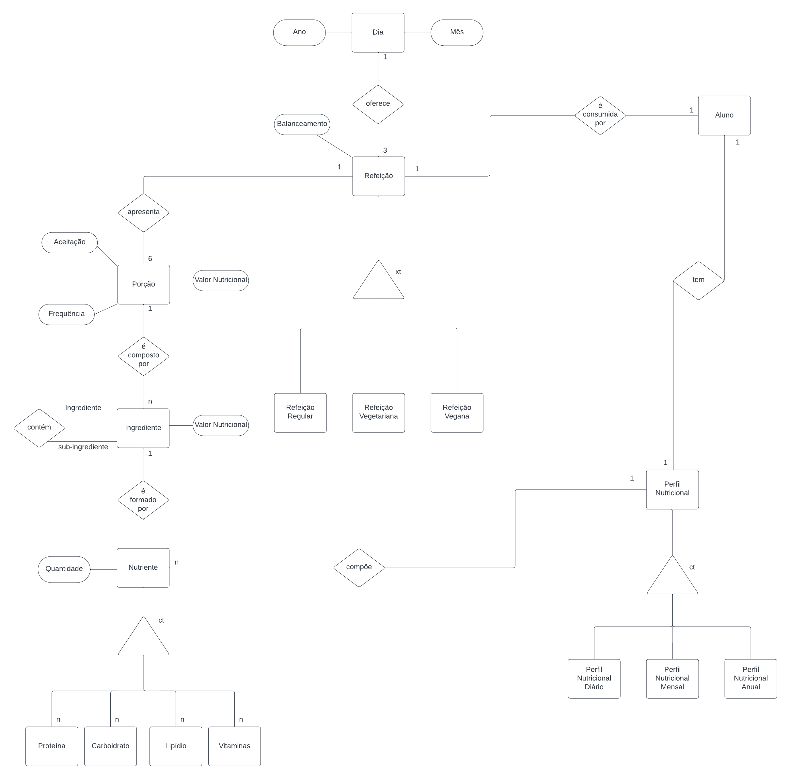

# Equipe `PLAY`

# Subgrupo `A`
* `Luiz Felipe Corradini Rego Costa` - `230613`
* `Pablo Henrique Almeida Mendes` - `230977`
* `Pedro da Rosa Pinheiro` - `231081`

## Modelo Conceitual ER Antigo

## Modelo Conceitual ER Revisado

*Diagrama ER Revisado*

## Mapeamento para o Modelo Relacional

~~~
DIA(Ano, Mês, _Dia_)
CARDAPIO (_ID Cardapio_, Balanceamento, Guarnicao, Sobremesa, Salada, Fruta, Prato Principal Regular, Prato Principal Vegano)
    Guarnição chave estrangeira -> Porção (ID Porção)
    Sobremesa chave estrangeira -> Porção (ID Porção)
    Salada chave estrangeira -> Porção (ID Porção)
    Fruta chave estrangeira -> Porção (ID Porção)
    Prato Principal Regular chave estrangeira -> Porção (ID Porção)
    Prato Principal Vegano chave estrangeira -> Porção (ID Porção)
REFEIÇÃO (_ID Refeição_, ID Cardapio, Dia, RA, Perfil Nutricional)
    ID Cardápio chave estrangeira -> CARDÁPIO (ID Cardápio)
    Dia chave estrangeira -> DIA (Dia)
    RA chave estrangeira -> Aluno (RA)
ALUNO (_RA_, Nome)
PORÇÃO (Aceitação, Frequência, Valor Nutricional, _ID Porção_)
COMPONENTES (_ID Componentes_, ID Porção, ID Ingrediente)
    ID Porção chave estrangeira -> Porção (ID Porção)
    ID Ingrediente chave estrangeira -> Ingrediente (ID Ingrediente)
INGREDIENTE (ID Ingrediente, Valor Energético, Quantidade Proteína, Quantidade Carboidrato, Quantidade Lipídio, Quantidade Vitaminas)
INTER INGREDIENTES (Principal, Sub-Ingredientes)
    Principal chave estrangeira -> Ingrediente (ID Ingrediente)
    Sub-Ingredientes chave estrangeira -> Ingrediente (ID Ingrediente)
~~~
