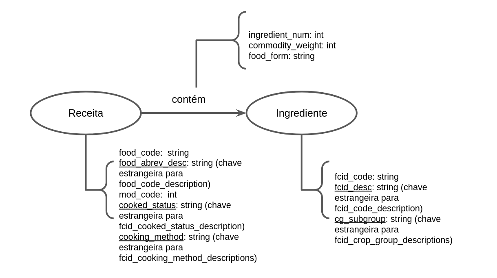

## Modelo Lógico

## Perguntas

### 1)

Qual o peso total de cada receita?

### 2)

Quais os ingredientes mais usados dentre cada método de preparo de cada receita?

### 3)

Quais os subgrupos dos ingredientes utilizados em cada Receita?
