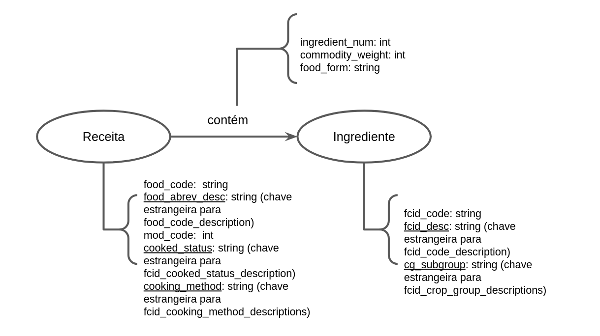

# Equipe `PLAY`

# Subgrupo `A`
* `Luiz Felipe Corradini Rego Costa` - `230613`
* `Pedro da Rosa Pinheiro` - `231081`

## Modelo Lógico do Banco de Dados de Grafos

## Perguntas de Pesquisa/Análise Combinadas e Respectivas Análises

>
### Quais são as receitas que mais possuem ingredientes em comum com outras receitas?
> 
>  * Para responder a essa análise, precisamos, primeiramente, alterar nosso grafo inicial. Como nosso grafo é bipartido, podemos realizar um projeção, na qual ligaremos receitas entre si, atribuindo uma propriedade de peso à aresta conectora, na qual o peso equivale ao número de ingredientes em comum. Desse modo, utilizando o conceito de closeness centrality, podemos encontrar, calculando para cada nó do grafo, os nós com maiores coeficientes de proximidade, isto é, as receitas que mais possuem ingredientes variados, e, portanto, possuem grande diversidade de nutrientes e de subgrupos de ingredientes.

### Quais ingredientes que não são utilizados em conjunto em nenhuma receita, poderiam potencialmente formar uma combinação?
>   
>   * Podemos procurar ingredientes que apresentam poucas ou nenhuma receitas em comum, mas, das receitas que fazem parte, existem muitos ingredientes em congruência. Por exemplo: geleia e pasta de amendoim. Ambos aparecem em suas respectivas receitas, que, em grande parte, apresentam os mesmos ingredientes, como, por exemplo, torrada com geleia e torrada com pasta de amendoim. Consequentemente, por mais que não registrado, é possível estabelecer um alto grau de combinação entre ambos ingredientes. Precisamos, para tal análise, analisar os motifs triangulares dentro do grafo, no qual os ingredientes A e B fazem parte da receita X e a os ingredientes B e C compõe a receita Y. Assim, conforme encontramos múltiplas receitas em que A e C estão interligados indiretamente, podemos estabelecer, no fim, uma relação entre os dois.

### Como podemos identificar diferentes grupos de receitas?
>   
>   * Nesse caso, precisamos avaliar o conceito de comunidade. Para isso, realizamos uma projeção, para que apenas receitas estejam interligadas. Para analisar as comunidades, verificamos os conjuntos de nós que existem mais arestas entre eles, e poucas arestas ligadas a outros nós fora deles. Assim, conseguimos separar o nosso grafo em comunidades, ou seja, conseguimos encontrar diferentes grupos de receitas. Por exemplo, se verificamos que o kibe e a esfirra estão interligados fortemente, por conter diversos ingredientes em comum, podemos avaliar que pertencem à mesma comunidade (no caso, a árabe).
